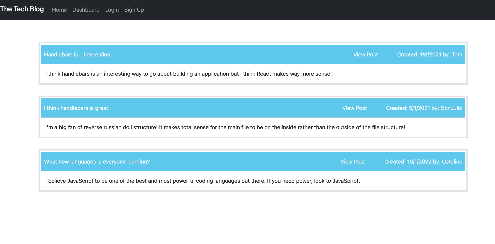

# tech-blog-2022

## Table of Contents
- [Description](#description)
- [Installation](#installation)
- [Usage](#usage)
- [Contributing](#contributing)
- [Testing](#testing)
- [License](#license)
- [Questions](#userName)

## Description
This is a pplication that will allow multiple users to connect over their thoughts and opinions on all things tech.

## Installation
Make sure when tyring to use this app, that you run npm install and set up your own .env folder to work properlly with sequelize.

## Usage
This application is used for having discussions on all things tech.

## Contributing
Marshall Jacob

## Testing

## License
Academic

## Questions

### If you have any questions you can find me through

Github [MarshallJacob](https://github.com/MarshallJacob)
or
Email marshall.jacob16@icloud.com

